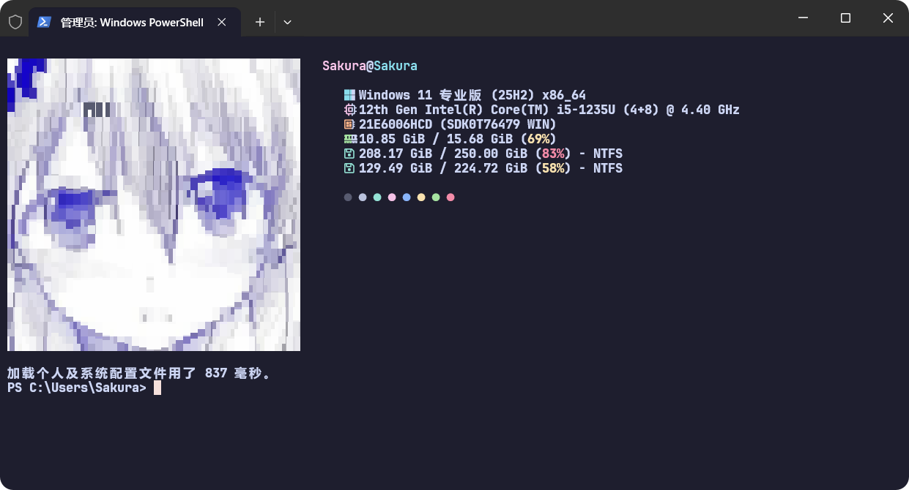
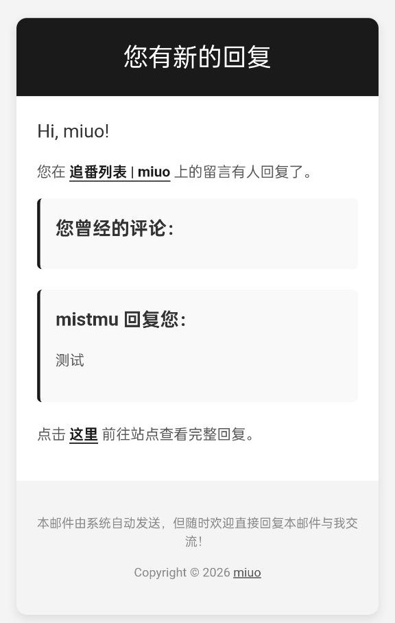
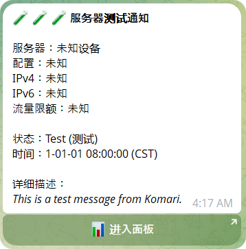

# dotfiles

个人配置备份，换电脑快速复原。

## mpv

视频播放器，基于 [mpv](https://mpv.io) + [uosc](https://github.com/tomasklaen/uosc) 打造。


- `mpv.conf` — 主配置文件（快捷键、解码、画质等）
- `script-opts/uosc.conf` — uosc 界面配置
- `scripts/` — 脚本（uosc 控件、长按倍速等）
- `fonts/` — uosc 图标字体

## Rime

中文输入法，基于 [雾凇拼音](https://github.com/iDvel/rime-ice)。


- `default.custom.yaml` — 全局自定义
- `weasel.custom.yaml` — 小狼毫前端配置
- `rime_ice.custom.yaml` — 雾凇拼音补丁
- `double_pinyin_flypy.custom.yaml` — 双拼方案补丁
- `custom_phrase.txt` — 自定义短语
- 其余为雾凇拼音上游词库、方案、Lua 脚本

## 终端美化

> 完整教程：[Windows 终端美化](https://blog.miuo.me/posts/windows-terminal-beautify/)

基于 [Windows Terminal](https://github.com/microsoft/terminal) + [Fastfetch](https://github.com/fastfetch-cli/fastfetch) + [chafa](https://github.com/hpjansson/chafa)，搭配 Catppuccin Mocha 配色与 JetBrainsMono Nerd Font。



### Windows Terminal

- `settings.json` — 配色方案、亚克力模糊、字体、按键绑定

### PowerShell

- `profile.ps1` — UTF-8 编码、启动 Fastfetch、oh-my-posh 主题

### fastfetch

- `config.jsonc` — 模块布局、Catppuccin 色板
- `ascii.txt` — chafa 生成的 ANSI 字符画

## Artalk

博客评论系统，基于 [Artalk](https://artalk.js.org)。

- `reply-template.html` — 邮件回复通知模板



## Komari

服务器监控工具，Telegram 通知脚本。

- `notification-template.txt` — TG 通知模板（离线/上线/告警/续费/到期）



## Anki

学习卡片工具，自制插件自动同步学习数据到 Gist。

- `__init__.py` — 插件入口（工具栏按钮 + 菜单）
- `gist_updater.py` — 获取学习数据、更新 Gist

## 使用

```powershell
# 克隆
git clone https://github.com/mistn/dotfiles.git

# mpv — 将 portable_config 软链接到 scoop mpv 目录
New-Item -ItemType SymbolicLink -Path "$env:SCOOP\persist\mpv\portable_config" -Target "D:\dotfiles\mpv\portable_config"

# Rime — 将 Rime 目录软链接到 Rime 用户目录
New-Item -ItemType SymbolicLink -Path "$env:APPDATA\Rime" -Target "D:\dotfiles\Rime"

# fastfetch — 将 fastfetch 目录软链接到 .config
New-Item -ItemType SymbolicLink -Path "$env:USERPROFILE\.config\fastfetch" -Target "D:\dotfiles\fastfetch"

# Windows Terminal — 将 settings.json 软链接到 Terminal 配置目录
$WT = Resolve-Path "$env:LOCALAPPDATA\Packages\Microsoft.WindowsTerminal_*\LocalState"
New-Item -ItemType SymbolicLink -Path "$WT\settings.json" -Target "D:\dotfiles\terminal\settings.json"

# PowerShell — 将 profile.ps1 软链接到 PowerShell 目录
New-Item -ItemType SymbolicLink -Path "$PROFILE" -Target "D:\dotfiles\powershell\profile.ps1"
```
